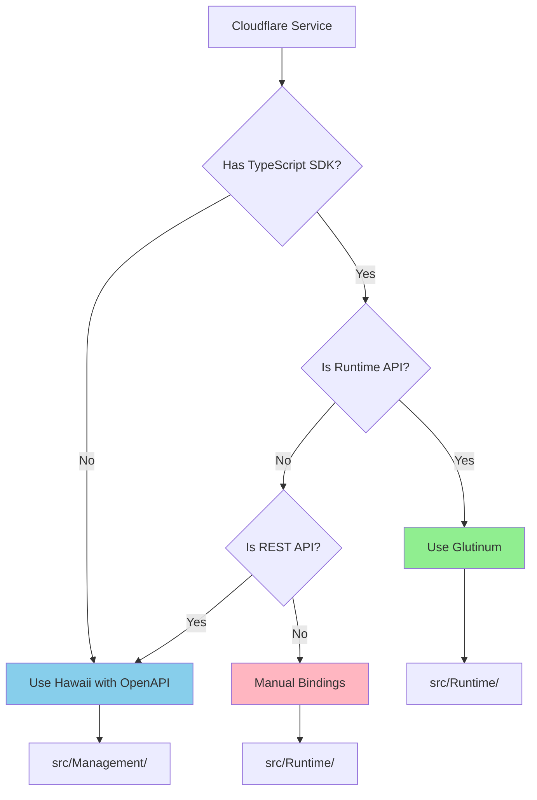

# CloudflareFS Binding Generation Strategy

## Overview

This document defines the comprehensive strategy for generating CloudflareFS bindings, distinguishing between services with TypeScript SDKs (use Glutinum) versus those only available via OpenAPI (use Hawaii). The approach maintains source schemas as pristine references while creating an automated, repeatable generation pipeline.

## Generation Decision Matrix

| Service | TypeScript SDK | OpenAPI | Generation Tool | Rationale |
|---------|---------------|---------|-----------------|-----------|
| **Workers Runtime** | `@cloudflare/workers-types` | ❌ | **Glutinum** | In-Worker APIs, need JS interop |
| **KV Runtime** | `@cloudflare/workers-types` | ❌ | **Glutinum** | In-Worker APIs, need JS interop |
| **R2 Runtime** | `@cloudflare/workers-types` | ❌ | **Glutinum** | In-Worker APIs, need JS interop |
| **D1 Runtime** | `@cloudflare/workers-types` | ❌ | **Glutinum** | In-Worker APIs, need JS interop |
| **AI** | `@cloudflare/ai` | ✅ | **Glutinum** | Has TypeScript SDK |
| **KV Management** | ❌ | ✅ | **Hawaii** | REST API only |
| **R2 Management** | ❌ | ✅ | **Hawaii** | REST API only |
| **D1 Management** | ❌ | ✅ | **Hawaii** | REST API only |
| **Workers Management** | ❌ | ✅ | **Hawaii** | REST API only |
| **DNS** | ❌ | ✅ | **Hawaii** | REST API only |
| **Zero Trust** | ❌ | ✅ | **Hawaii** | REST API only |
| **Analytics** | ❌ | ✅ | **Hawaii** | REST API only |

## Automated Pipeline Architecture

```
┌─────────────────────────────────────────────────────────────┐
│                    SOURCE CONTROL (Pristine)                │
├─────────────────────────────────────────────────────────────┤
│ D:/repos/Cloudflare/api-schemas/  (NEVER MODIFIED)          │
│   ├── openapi.json                                          │
│   ├── openapi.yaml                                          │
│   └── common.yaml                                           │
│                                                              │
│ node_modules/ (via npm)                                     │
│   ├── @cloudflare/workers-types/                            │
│   └── @cloudflare/ai/                                       │
└─────────────────────────────────────────────────────────────┘
                              │
                              ▼
┌─────────────────────────────────────────────────────────────┐
│                    GENERATION PIPELINE                       │
├─────────────────────────────────────────────────────────────┤
│ generators/                                                  │
│   ├── update-and-generate.ps1  (Master Script)              │
│   ├── .gitignore               (Ignore all temp files)      │
│   │                                                          │
│   ├── glutinum/                (TypeScript → F#)            │
│   │   ├── temp/                [GENERATED/IGNORED]          │
│   │   │   └── workers-types.d.ts                            │
│   │   └── generate-runtime.ps1                              │
│   │                                                          │
│   └── hawaii/                  (OpenAPI → F#)               │
│       ├── temp/                [GENERATED/IGNORED]          │
│       │   ├── KV-openapi.json                               │
│       │   ├── R2-openapi.json                               │
│       │   └── D1-openapi.json                               │
│       ├── extract-service.ps1                               │
│       └── generate-management.ps1                           │
└─────────────────────────────────────────────────────────────┘
                              │
                              ▼
┌─────────────────────────────────────────────────────────────┐
│                    GENERATED OUTPUT                          │
├─────────────────────────────────────────────────────────────┤
│ src/                                                         │
│   ├── Runtime/     (Glutinum-generated from TypeScript)     │
│   │   ├── CloudFlare.Worker.Context/                        │
│   │   ├── CloudFlare.KV/                                    │
│   │   ├── CloudFlare.R2/                                    │
│   │   └── CloudFlare.D1/                                    │
│   │                                                          │
│   └── Management/  (Hawaii-generated from OpenAPI)          │
│       ├── CloudFlare.Api.Storage.KV/                        │
│       ├── CloudFlare.Api.Storage.R2/                        │
│       └── CloudFlare.Api.Storage.D1/                        │
└─────────────────────────────────────────────────────────────┘
```

## Master Generation Script

```powershell
# generators/update-and-generate.ps1
# "Fire and Forget" script to update sources and regenerate all bindings

param(
    [switch]$UpdateSources = $true,
    [switch]$RuntimeOnly = $false,
    [switch]$ManagementOnly = $false,
    [switch]$Clean = $false
)

$ErrorActionPreference = "Stop"

Write-Host "CloudflareFS Binding Generation Pipeline" -ForegroundColor Cyan
Write-Host "=========================================" -ForegroundColor Cyan

# Step 1: Update source schemas if requested
if ($UpdateSources) {
    Write-Host "`n[1/4] Updating Source Schemas..." -ForegroundColor Yellow

    # Update Cloudflare API schemas (assuming git submodule or direct clone)
    Push-Location "D:/repos/Cloudflare/api-schemas"
    git pull origin main
    Pop-Location

    # Update TypeScript packages
    Write-Host "Updating TypeScript packages..."
    npm update @cloudflare/workers-types @cloudflare/ai
}

# Step 2: Clean temporary files if requested
if ($Clean) {
    Write-Host "`n[2/4] Cleaning temporary files..." -ForegroundColor Yellow
    Remove-Item -Path "./glutinum/temp" -Recurse -Force -ErrorAction SilentlyContinue
    Remove-Item -Path "./hawaii/temp" -Recurse -Force -ErrorAction SilentlyContinue
}

# Step 3: Generate Runtime bindings (TypeScript → F#)
if (-not $ManagementOnly) {
    Write-Host "`n[3/4] Generating Runtime Bindings (Glutinum)..." -ForegroundColor Yellow

    # Ensure temp directory exists
    New-Item -ItemType Directory -Path "./glutinum/temp" -Force | Out-Null

    # Copy TypeScript definitions to temp
    Copy-Item "../../node_modules/@cloudflare/workers-types/index.d.ts" `
              "./glutinum/temp/workers-types.d.ts" -Force

    # Generate bindings
    & ./glutinum/generate-runtime.ps1

    if ($LASTEXITCODE -ne 0) {
        Write-Error "Runtime binding generation failed"
        exit 1
    }
}

# Step 4: Generate Management bindings (OpenAPI → F#)
if (-not $RuntimeOnly) {
    Write-Host "`n[4/4] Generating Management Bindings (Hawaii)..." -ForegroundColor Yellow

    # Ensure temp directory exists
    New-Item -ItemType Directory -Path "./hawaii/temp" -Force | Out-Null

    # Extract service-specific OpenAPI specs
    $services = @("KV", "R2", "D1", "Workers", "DNS", "Access")
    foreach ($service in $services) {
        Write-Host "  Extracting $service OpenAPI..." -ForegroundColor Gray
        & ./hawaii/extract-service.ps1 `
            -Service $service `
            -InputFile "D:/repos/Cloudflare/api-schemas/openapi.json" `
            -OutputFile "./hawaii/temp/$service-openapi.json"
    }

    # Generate F# bindings
    & ./hawaii/generate-management.ps1 -TempDir "./hawaii/temp"

    if ($LASTEXITCODE -ne 0) {
        Write-Error "Management binding generation failed"
        exit 1
    }
}

Write-Host "`n✅ Generation Complete!" -ForegroundColor Green
Write-Host "Runtime bindings:    src/Runtime/" -ForegroundColor Gray
Write-Host "Management bindings: src/Management/" -ForegroundColor Gray
```

## Service Extraction Script (Preserves Original)

```powershell
# generators/hawaii/extract-service.ps1
# Extracts service-specific OpenAPI without modifying source

param(
    [Parameter(Mandatory=$true)]
    [string]$Service,

    [Parameter(Mandatory=$true)]
    [string]$InputFile,  # Points to pristine source

    [Parameter(Mandatory=$true)]
    [string]$OutputFile  # Writes to temp directory
)

# Path patterns for each service
$pathPatterns = @{
    "KV" = @{
        paths = @("/accounts/{account_id}/storage/kv")
        schemas = @("kv_", "api-response-single", "api-response-collection")
    }
    "R2" = @{
        paths = @("/accounts/{account_id}/r2")
        schemas = @("r2_", "api-response-single", "api-response-collection")
    }
    "D1" = @{
        paths = @("/accounts/{account_id}/d1")
        schemas = @("d1_", "api-response-single", "api-response-collection")
    }
    "Workers" = @{
        paths = @("/accounts/{account_id}/workers/scripts", "/accounts/{account_id}/workers/services")
        schemas = @("workers_", "script_", "api-response-single")
    }
    "DNS" = @{
        paths = @("/zones/{zone_id}/dns_records")
        schemas = @("dns_", "api-response-single", "api-response-collection")
    }
    "Access" = @{
        paths = @("/accounts/{account_id}/access")
        schemas = @("access_", "api-response-single", "api-response-collection")
    }
}

Write-Host "Extracting $Service from $InputFile..."

# Load source OpenAPI (read-only)
$spec = Get-Content $InputFile -Raw | ConvertFrom-Json

# Create filtered specification
$filtered = [ordered]@{
    openapi = $spec.openapi
    info = @{
        title = "Cloudflare $Service API"
        version = $spec.info.version
        description = "Extracted from full Cloudflare OpenAPI for $Service service"
    }
    servers = $spec.servers
    paths = [ordered]@{}
    components = @{
        schemas = @{}
        parameters = @{}
        responses = @{}
        securitySchemes = $spec.components.securitySchemes
    }
}

# Extract matching paths
$pattern = $pathPatterns[$Service]
$extractedPaths = 0

foreach ($path in $spec.paths.PSObject.Properties) {
    $matched = $false
    foreach ($pathPattern in $pattern.paths) {
        if ($path.Name -like "*$pathPattern*") {
            $filtered.paths[$path.Name] = $path.Value
            $extractedPaths++
            $matched = $true
            break
        }
    }
}

# Extract related schemas
$extractedSchemas = 0
foreach ($schema in $spec.components.schemas.PSObject.Properties) {
    foreach ($schemaPattern in $pattern.schemas) {
        if ($schema.Name -like "$schemaPattern*") {
            $filtered.components.schemas[$schema.Name] = $schema.Value
            $extractedSchemas++
            break
        }
    }
}

Write-Host "✓ Extracted $extractedPaths paths and $extractedSchemas schemas"

# Save to temp directory (never overwrites source)
$outputDir = Split-Path $OutputFile -Parent
New-Item -ItemType Directory -Path $outputDir -Force | Out-Null
$filtered | ConvertTo-Json -Depth 100 | Out-File $OutputFile -Encoding UTF8

Write-Host "✓ Saved to $OutputFile"
```

## Directory Structure with .gitignore

```
generators/
├── .gitignore                    # Critical for keeping temp files out of git
├── update-and-generate.ps1       # Master automation script
│
├── glutinum/
│   ├── generate-runtime.ps1      # Glutinum generation
│   ├── simplify-types.js         # Optional preprocessor
│   └── temp/                     # IGNORED - TypeScript copies
│       └── *.d.ts
│
└── hawaii/
    ├── extract-service.ps1       # Service extraction
    ├── generate-management.ps1   # Hawaii generation
    ├── configs/                   # Hawaii configurations (committed)
    │   ├── KV-hawaii.json
    │   ├── R2-hawaii.json
    │   └── D1-hawaii.json
    └── temp/                      # IGNORED - Extracted OpenAPI
        └── *-openapi.json
```

### .gitignore for Generators

```gitignore
# generators/.gitignore
# Temporary files created during generation
glutinum/temp/
hawaii/temp/
hawaii/extracted/

# Downloaded/copied TypeScript definitions
*.d.ts

# Extracted OpenAPI files (regenerated from source)
*-openapi.json

# But keep configuration files
!hawaii/configs/*.json

# Log files
*.log

# Backup files
*.bak
*.backup
```

## Runtime vs Management Decision Tree



## Continuous Integration

```yaml
# .github/workflows/regenerate-bindings.yml
name: Regenerate Bindings

on:
  schedule:
    - cron: '0 0 * * 0'  # Weekly on Sunday
  workflow_dispatch:      # Manual trigger

jobs:
  regenerate:
    runs-on: windows-latest
    steps:
      - uses: actions/checkout@v3
        with:
          submodules: true

      - name: Setup .NET
        uses: actions/setup-dotnet@v3
        with:
          dotnet-version: '8.0.x'

      - name: Setup Node.js
        uses: actions/setup-node@v3
        with:
          node-version: '18'

      - name: Install Tools
        run: |
          npm install -g @glutinum/cli
          dotnet tool install -g hawaii

      - name: Update Dependencies
        run: |
          npm update
          cd D:/repos/Cloudflare/api-schemas
          git pull origin main

      - name: Generate Bindings
        run: |
          cd generators
          ./update-and-generate.ps1 -UpdateSources

      - name: Run Tests
        run: dotnet test

      - name: Create PR if Changed
        uses: peter-evans/create-pull-request@v5
        with:
          title: 'chore: Update generated bindings'
          body: 'Automated update of F# bindings from latest Cloudflare APIs'
          branch: update-bindings
```

## Benefits of This Approach

### 1. **Source Preservation**
- Original OpenAPI schemas remain untouched
- Can track upstream changes via git
- Clear separation between source and generated

### 2. **Tool Selection Logic**
- Use Glutinum when TypeScript SDK exists (better for runtime)
- Use Hawaii for REST APIs (better for management)
- Clear decision matrix prevents confusion

### 3. **Full Automation**
- Single command regenerates everything
- CI/CD can run weekly to catch API changes
- No manual intervention required

### 4. **Reproducibility**
- Anyone can regenerate bindings from scratch
- Temporary files are gitignored
- Only configuration is committed

### 5. **Maintainability**
- Clear separation of concerns
- Each tool optimized for its use case
- Easy to add new services

## Implementation Timeline

### Phase 1: Setup (Day 1)
- [ ] Create generator directory structure
- [ ] Set up .gitignore files
- [ ] Write master automation script

### Phase 2: Runtime Bindings (Day 2-3)
- [ ] Configure Glutinum for workers-types
- [ ] Generate Worker.Context bindings
- [ ] Generate KV, R2, D1 runtime bindings

### Phase 3: Management Bindings (Day 4-5)
- [ ] Write service extraction script
- [ ] Configure Hawaii for each service
- [ ] Generate management APIs

### Phase 4: Automation (Day 6-7)
- [ ] Test full pipeline end-to-end
- [ ] Set up CI/CD workflow
- [ ] Document usage

## Conclusion

This revised strategy ensures that:
1. Source schemas are never modified
2. TypeScript SDKs are preferred when available (via Glutinum)
3. OpenAPI is used for management APIs (via Hawaii)
4. Everything can be regenerated with a single command
5. The process is fully automated and reproducible

The "fire and forget" approach means developers can simply run `./update-and-generate.ps1` to get the latest bindings without understanding the underlying complexity.