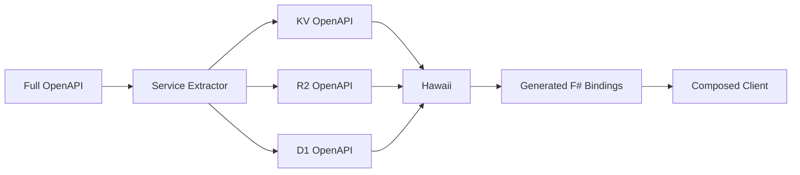

# Hawaii Generation Plan for CloudflareFS Management APIs

## Overview

This document outlines the specific implementation plan for using Hawaii to generate F# bindings from Cloudflare's OpenAPI specifications for **Management APIs only**. Runtime APIs with TypeScript SDKs will use Glutinum instead. The plan focuses on creating maintainable, modular, and idiomatic F# client libraries while preserving source schemas.

## Challenge: OpenAPI Specification Size

The Cloudflare OpenAPI spec is **15.5MB** with **300,000+ lines**, containing:
- **1,000+ endpoints** across 50+ services
- **500+ schema definitions**
- **Deeply nested references**

This presents challenges:
1. Hawaii may struggle with the full spec
2. Generated code would be monolithic
3. Compilation times would be excessive
4. IntelliSense performance would suffer

## Solution: Service-Specific Generation

### Strategy: Extract → Generate → Compose (Without Modifying Sources)



## Implementation Plan

### Step 1: Create Service Extraction Pipeline (to Temp Directory)

```powershell
# extract-service-openapi.ps1
param(
    [Parameter(Mandatory=$true)]
    [ValidateSet("KV", "R2", "D1", "Workers", "DNS", "Access")]
    [string]$Service,

    [string]$InputFile = "D:/repos/Cloudflare/api-schemas/openapi.json",  # Pristine source
    [string]$OutputDir = "./temp"  # Temporary directory (gitignored)
)

$pathPatterns = @{
    "KV" = @("/accounts/[\w-]+/storage/kv")
    "R2" = @("/accounts/[\w-]+/r2")
    "D1" = @("/accounts/[\w-]+/d1")
    "Workers" = @("/accounts/[\w-]+/workers/scripts", "/accounts/[\w-]+/workers/services")
    "DNS" = @("/zones/[\w-]+/dns_records")
    "Access" = @("/accounts/[\w-]+/access")
}

# Load and parse OpenAPI
$spec = Get-Content $InputFile | ConvertFrom-Json

# Create filtered specification
$filtered = [ordered]@{
    openapi = $spec.openapi
    info = @{
        title = "Cloudflare $Service API"
        version = $spec.info.version
    }
    servers = $spec.servers
    paths = [ordered]@{}
    components = @{
        schemas = @{}
        parameters = @{}
        responses = @{}
    }
}

# Extract service-specific paths
$patterns = $pathPatterns[$Service]
$referencedSchemas = New-Object System.Collections.Generic.HashSet[string]

foreach ($path in $spec.paths.PSObject.Properties) {
    $matched = $false
    foreach ($pattern in $patterns) {
        if ($path.Name -match $pattern) {
            $matched = $true
            break
        }
    }

    if ($matched) {
        $filtered.paths[$path.Name] = $path.Value
        # Collect schema references
        ExtractReferences $path.Value $referencedSchemas
    }
}

# Extract only referenced schemas
foreach ($schemaName in $referencedSchemas) {
    if ($spec.components.schemas.$schemaName) {
        $filtered.components.schemas[$schemaName] = $spec.components.schemas.$schemaName
    }
}

# Save extracted OpenAPI to temp directory (never modifies source)
$outputFile = Join-Path $OutputDir "$Service-openapi.json"
$filtered | ConvertTo-Json -Depth 100 | Out-File $outputFile
Write-Host "✓ Extracted $Service API to $outputFile (temp)"
```

### Step 2: Configure Hawaii for Each Service

#### KV Storage Configuration
```json
{
  "namespace": "CloudFlare.Api.Storage.KV",
  "synchronous": false,
  "target": "fsharp",
  "emptyDefinitions": "ignore",
  "generateClient": true,
  "clientName": "KVClient",
  "overrideOperationIds": {
    "kv-namespaces-list-namespaces": "ListNamespaces",
    "kv-namespaces-create-namespace": "CreateNamespace",
    "kv-namespaces-remove-namespace": "DeleteNamespace",
    "kv-namespaces-rename-namespace": "UpdateNamespace",
    "kv-namespace-write-key-value-pair": "PutValue",
    "kv-namespace-read-key-value-pair": "GetValue",
    "kv-namespace-delete-key-value-pair": "DeleteValue",
    "kv-namespace-list-keys": "ListKeys"
  },
  "overrideSchemas": {
    "kv_namespace": {
      "name": "KVNamespace"
    },
    "kv_namespace_key_list": {
      "name": "KVKeyList"
    }
  }
}
```

#### R2 Storage Configuration
```json
{
  "namespace": "CloudFlare.Api.Storage.R2",
  "synchronous": false,
  "target": "fsharp",
  "emptyDefinitions": "ignore",
  "generateClient": true,
  "clientName": "R2Client",
  "overrideOperationIds": {
    "r2-list-buckets": "ListBuckets",
    "r2-create-bucket": "CreateBucket",
    "r2-delete-bucket": "DeleteBucket",
    "r2-get-bucket": "GetBucket",
    "r2-put-bucket-encryption": "SetBucketEncryption",
    "r2-delete-bucket-encryption": "DeleteBucketEncryption",
    "r2-get-bucket-usage": "GetBucketUsage"
  }
}
```

#### D1 Database Configuration
```json
{
  "namespace": "CloudFlare.Api.Storage.D1",
  "synchronous": false,
  "target": "fsharp",
  "emptyDefinitions": "ignore",
  "generateClient": true,
  "clientName": "D1Client",
  "overrideOperationIds": {
    "d1-list-databases": "ListDatabases",
    "d1-create-database": "CreateDatabase",
    "d1-delete-database": "DeleteDatabase",
    "d1-get-database": "GetDatabase",
    "d1-query-database": "QueryDatabase"
  }
}
```

### Step 3: Generate F# Bindings

```powershell
# generate-management-apis.ps1
param(
    [string[]]$Services = @("KV", "R2", "D1", "Workers", "DNS", "Access")
)

# Step 1: Extract service-specific OpenAPI specs
# Ensure temp directory exists and is clean
Remove-Item "./temp" -Recurse -Force -ErrorAction SilentlyContinue
New-Item -ItemType Directory -Path "./temp" -Force | Out-Null

foreach ($service in $Services) {
    Write-Host "Extracting $service OpenAPI..." -ForegroundColor Cyan
    .\extract-service-openapi.ps1 -Service $service -OutputDir "./temp"
}

# Step 2: Generate F# bindings with Hawaii
foreach ($service in $Services) {
    Write-Host "Generating F# bindings for $service..." -ForegroundColor Cyan

    $inputFile = "./temp/$service-openapi.json"  # From temp directory
    $configFile = "./hawaii-configs/$service-hawaii.json"
    $outputFile = "../src/Management/CloudFlare.Api.$service/Generated.fs"

    # Ensure output directory exists
    $outputDir = Split-Path $outputFile -Parent
    New-Item -ItemType Directory -Path $outputDir -Force | Out-Null

    # Run Hawaii
    hawaii $inputFile --config $configFile --output $outputFile

    if ($LASTEXITCODE -eq 0) {
        Write-Host "✓ Generated $service bindings" -ForegroundColor Green
    } else {
        Write-Error "Failed to generate $service bindings"
    }
}
```

### Step 4: Create Unified Client Interface

```fsharp
// src/Management/CloudFlare.Api/Client.fs
namespace CloudFlare.Api

open System
open System.Net.Http
open CloudFlare.Api.Storage.KV
open CloudFlare.Api.Storage.R2
open CloudFlare.Api.Storage.D1

type CloudflareClient(apiToken: string, ?httpClient: HttpClient) =
    let httpClient = defaultArg httpClient (new HttpClient())

    do
        httpClient.DefaultRequestHeaders.Add("Authorization", $"Bearer {apiToken}")
        httpClient.BaseAddress <- Uri("https://api.cloudflare.com/client/v4/")

    member _.KV = KVClient(httpClient)
    member _.R2 = R2Client(httpClient)
    member _.D1 = D1Client(httpClient)

    interface IDisposable with
        member _.Dispose() = httpClient.Dispose()

// Computation expression for resource creation
type CloudflareBuilder(client: CloudflareClient) =
    member _.Yield(_) = client
    member _.Zero() = client

    [<CustomOperation("kv")>]
    member _.CreateKV(client: CloudflareClient, accountId: string, title: string) = async {
        let! result = client.KV.CreateNamespace(accountId, { title = title })
        return result
    }

    [<CustomOperation("r2")>]
    member _.CreateR2(client: CloudflareClient, accountId: string, name: string) = async {
        let! result = client.R2.CreateBucket(accountId, { name = name })
        return result
    }

    [<CustomOperation("d1")>]
    member _.CreateD1(client: CloudflareClient, accountId: string, name: string) = async {
        let! result = client.D1.CreateDatabase(accountId, { name = name })
        return result
    }
```

### Step 5: Create Idiomatic F# Wrappers

```fsharp
// src/Management/CloudFlare.Api.Storage.KV/Extensions.fs
module CloudFlare.Api.Storage.KV.Extensions

open CloudFlare.Api.Storage.KV

/// Active patterns for KV operations
let (|Found|NotFound|) (result: GetValueResponse) =
    match result.value with
    | Some v -> Found v
    | None -> NotFound

/// Async workflow helpers
type KVNamespaceExtensions =
    static member GetOrCreate(client: KVClient, accountId: string, title: string) = async {
        let! existing = client.ListNamespaces(accountId)
        match existing.result |> Array.tryFind (fun ns -> ns.title = title) with
        | Some ns -> return ns
        | None ->
            let! created = client.CreateNamespace(accountId, { title = title })
            return created.result
    }

    static member BulkWrite(client: KVClient, namespaceId: string, values: seq<string * string>) = async {
        let! results =
            values
            |> Seq.map (fun (key, value) ->
                client.PutValue(namespaceId, key, value))
            |> Async.Parallel
        return results
    }

/// Pipeline operators
let inline (>>=) (m: Async<'a>) (f: 'a -> Async<'b>) = async.Bind(m, f)
let inline (>>|) (m: Async<'a>) (f: 'a -> 'b) = async.Map(f, m)

/// Usage example
let workflow accountId = async {
    use client = new CloudflareClient(apiToken)

    // Get or create namespace
    let! ns = KVNamespaceExtensions.GetOrCreate(client.KV, accountId, "my-cache")

    // Bulk write
    let! _ = KVNamespaceExtensions.BulkWrite(client.KV, ns.id, [
        "key1", "value1"
        "key2", "value2"
    ])

    // Read with pattern matching
    let! result = client.KV.GetValue(ns.id, "key1")
    match result with
    | Found value -> printfn "Found: %s" value
    | NotFound -> printfn "Key not found"
}
```

## Directory Structure

```
CloudflareFS/
├── generators/
│   ├── hawaii/
│   │   ├── extract-service-openapi.ps1    # Service extraction script
│   │   ├── generate-management-apis.ps1   # Batch generation script
│   │   ├── temp/                           # TEMPORARY (gitignored)
│   │   │   ├── KV-openapi.json
│   │   │   ├── R2-openapi.json
│   │   │   └── D1-openapi.json
│   │   ├── .gitignore                      # Ignore temp directory
│   │   └── configs/                        # Hawaii configurations (committed)
│   │       ├── KV-hawaii.json
│   │       ├── R2-hawaii.json
│   │       └── D1-hawaii.json
│   └── ...
│
└── src/
    ├── Runtime/                            # Layer 1: In-Worker APIs
    │   ├── CloudFlare.Worker.Context/
    │   ├── CloudFlare.KV/
    │   ├── CloudFlare.R2/
    │   └── CloudFlare.D1/
    │
    └── Management/                         # Layer 2: Management APIs
        ├── CloudFlare.Api/                 # Unified client
        │   ├── Client.fs
        │   ├── Authentication.fs
        │   └── CloudFlare.Api.fsproj
        │
        ├── CloudFlare.Api.Storage.KV/      # KV management
        │   ├── Generated.fs                # Hawaii output
        │   ├── Extensions.fs               # F# helpers
        │   └── CloudFlare.Api.Storage.KV.fsproj
        │
        ├── CloudFlare.Api.Storage.R2/      # R2 management
        │   ├── Generated.fs
        │   ├── Extensions.fs
        │   └── CloudFlare.Api.Storage.R2.fsproj
        │
        └── CloudFlare.Api.Storage.D1/      # D1 management
            ├── Generated.fs
            ├── Extensions.fs
            └── CloudFlare.Api.Storage.D1.fsproj
```

## Benefits of This Approach

### 1. Manageable Scope
- Each service gets ~1-2MB OpenAPI spec instead of 15MB
- Hawaii can process smaller specs efficiently
- Generated code is modular and focused

### 2. Independent Versioning
- Services can be regenerated independently
- Breaking changes isolated to specific packages
- Easier to track API evolution

### 3. Better Performance
- Faster compilation with smaller generated files
- Better IntelliSense responsiveness
- Reduced memory usage in IDEs

### 4. Maintainability
- Clear separation of concerns
- Service-specific customizations possible
- Easier to debug and test

### 5. Flexibility
- Can use different Hawaii settings per service
- Custom post-processing per service
- Gradual rollout of updates

## Timeline

### Week 1: Infrastructure
- [ ] Set up extraction pipeline
- [ ] Create Hawaii configurations
- [ ] Test with KV service

### Week 2: Core Services
- [ ] Generate KV management API
- [ ] Generate R2 management API
- [ ] Generate D1 management API
- [ ] Create unified client

### Week 3: Extensions
- [ ] Add F# idiomatic wrappers
- [ ] Create computation expressions
- [ ] Add async workflow helpers

### Week 4: Testing & Documentation
- [ ] Integration tests
- [ ] Usage examples
- [ ] API documentation
- [ ] NuGet packaging

## Success Criteria

1. **Compilation**: Each service module compiles independently
2. **Size**: Generated files < 10K lines per service
3. **Performance**: IntelliSense responds in < 1 second
4. **Coverage**: All CRUD operations for KV, R2, D1
5. **Usability**: Idiomatic F# with async workflows

## Conclusion

By extracting service-specific OpenAPI specifications and generating focused F# bindings, we can leverage Hawaii effectively despite the massive size of Cloudflare's API surface. This modular approach ensures maintainability, performance, and a superior developer experience.